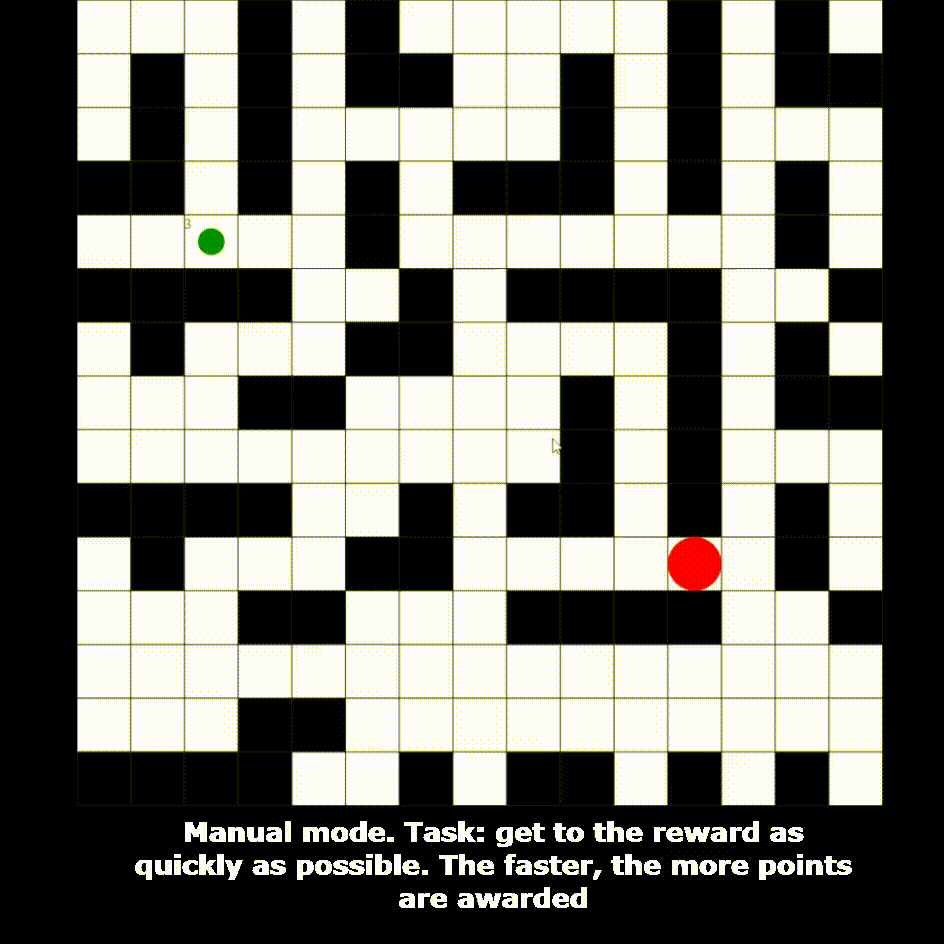

# Disappering balls

Arcade 2D game. The player's task is to gain the maximum number of points by moving around the map with obstacles. The player is represented by a red ball, and targets are indicated by green balls.
***
Rules:
- Collect as many green balls as possible in the minimum amount of time
- You can only move along white cells. Forbidden to go through black cells
***
There are two modes:
- Manual:
The user uses the keyboard to move around the map
- Automatic:
Using the Lee algorithm (wave algorithm), the player's ball itself moves along the playing field, finding the shortest path
***

